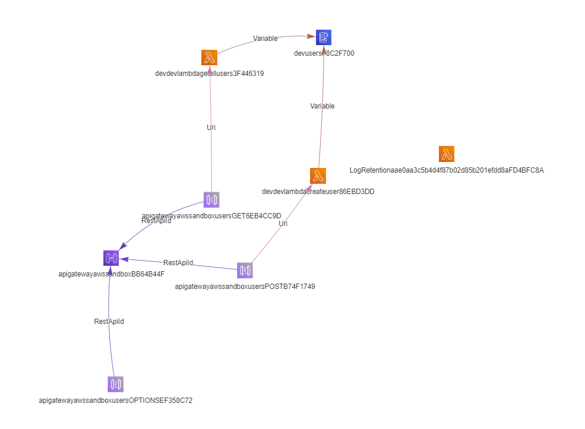
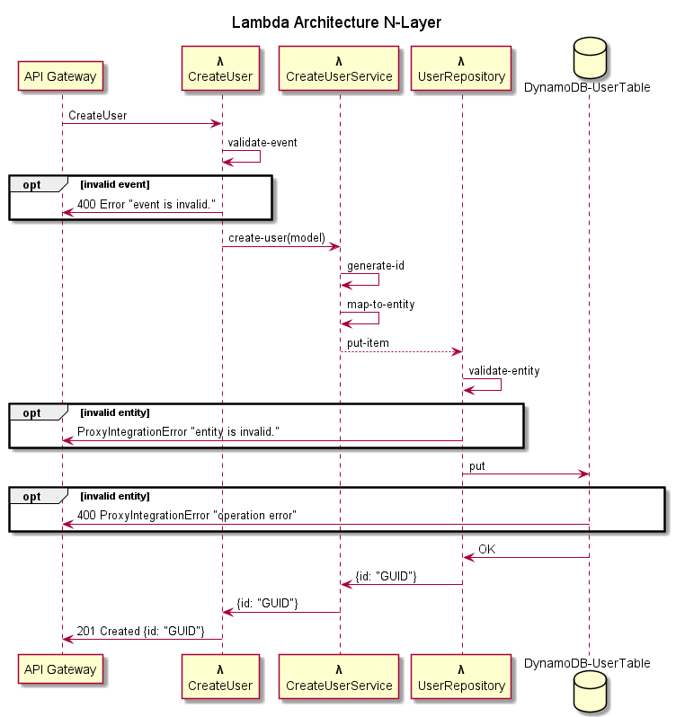

# my-aws-sandbox

## TD/TR

This is my sandbox AWS Serverless stack.

## Big Picture



## Limitations

This is single repository stack. In one place and as single CDK deployment we are creating all is needed to deliver working application.

AWS vendor locked-in

## AWS

-   CDK
-   Lambda
-   API Gateway
-   DynamoDB
-   X-RAY
-   CloudWatch

## TypeScript

-   prettier (clean code)
-   eslint (perfect code)
-   jest (tested)
-   ajv (validated data structures)

## thanks

🍺🍺🍺 for [Oskar Dudycz](https://github.com/oskardudycz) for [the template](https://github.com/oskardudycz/EventSourcing.NodeJS) to the project:

-   Github Action configuration
-   node.js configuration (prettier, eslint, tsconfig)

## Build

```bash

npm install
npm run build:ts
```

This will install the necessary CDK, then this example's dependencies, and then build your TypeScript files and your CloudFormation template.

## Deploy

### Prerequisites

```
npm install -g aws-cdk
```

### Deployment needed commands

$ cdk ls
<list all stacks in this program>

$ cdk synth
<generates and outputs cloudformation template>

$ cdk deploy
<deploys stack to your account>

$ cdk diff
<shows diff against deployed stack>

## Development

### CDK

#### add new resources

1. Extend the CdkResources class with new item based on the convention
1. Implement resources instance for CdkResources with new item name
1. use `generateResourceName` function to generate the resource name based on the convention

#### enable traceability for each resource:

-   for RestApi
-   for lambda please use `lambdaFactory` helper to generate CDK lambda with all needed setup

#### automatic tests

For now, we support a humao.rest-client with VS code HTTP tests.
Please remember for automatic and manual test -> to not spam PROD environment use **automatic-test** for \*_requestId_ header.

## decisions log

use the github [markdown emoji markup](https://gist.github.com/rxaviers/7360908) to show type for decision

| Emoji    | Short description      |
| -------- | ---------------------- |
| :cloud:  | Deployment             |
| :gift:   | Development            |
| :hammer: | Architecture decisions |

| Decision                            | Description                                                                                                                                                                                                                                   | Timeframe                                                         |
| ----------------------------------- | --------------------------------------------------------------------------------------------------------------------------------------------------------------------------------------------------------------------------------------------- | ----------------------------------------------------------------- |
| :cloud: vendor locked-in            | The solution is locked-in in the AWS Cloud - we don't want to build Multi Cloud solution.                                                                                                                                                     | 21.03.2021 [PR1](https://github.com/mjendza/aws-sandbox/pull/1)   |
| :hammer: Typescript                 | Typescript is awesome :heart: language for microservices (Typesafe and for small size of the repositories is maintainable). Very fast for prototyping and delivering simple solution.                                                         | 21.03.2021 [PR1](https://github.com/mjendza/aws-sandbox/pull/1)   |
| :cloud: CDK                         | We can define deployment with the Typescript language and forget about YAML or JSON.                                                                                                                                                          | 21.03.2021 [PR1](https://github.com/mjendza/aws-sandbox/pull/1)   |
| :cloud: github actions              | I want to try github actions as build server to CI. For now we don't want to publish stack to AWS.                                                                                                                                            | 23.03.2021 [PR3](https://github.com/mjendza/aws-sandbox/pull/3)   |
| :gift: eslint                       | Code can be verify for standard issues connected with JavaScript based on static analyze from eslint.                                                                                                                                         | 23.03.2021 [PR4](https://github.com/mjendza/aws-sandbox/pull/4)   |
| :gift: prettier                     | We can keep same formatting.                                                                                                                                                                                                                  | 23.03.2021 [PR4](https://github.com/mjendza/aws-sandbox/pull/4)   |
| :hammer: ajv                        | We want to validate json schema (and **only schema** for AWS Lambada incoming event) ajv is very simple validation library                                                                                                                    | 23.03.2021 [PR7](https://github.com/mjendza/aws-sandbox/pull/7)   |
| :man: manual testing                | We want to use humao.rest-client and VS code to make the HTTP requests the API GW                                                                                                                                                             | 31.03.2021 [PR7](https://github.com/mjendza/aws-sandbox/pull/7)   |
| :gift: webpack                      | We want to publish lambda Typescript code as JavaScript with webpack                                                                                                                                                                          | 31.03.2021 [PR7](https://github.com/mjendza/aws-sandbox/pull/7)   |
| :gift: ts-loader                    | To load dependencies we want to use ts-loaded based on [examples](https://github.com/TypeStrong/ts-loader/tree/main/examples)                                                                                                                 | 31.03.2021 [PR7](https://github.com/mjendza/aws-sandbox/pull/7)   |
| :cloud: X-RAY                       | We want to see the trace for each action in the system. The best option is to use AWS X-RAY.                                                                                                                                                  | 21.03.2021 [PR1](https://github.com/mjendza/aws-sandbox/pull/1)   |
| :hammer: node-lambda-log            | We want to try a library for [logging](https://github.com/KyleRoss/node-lambda-log), not sure if this is a best library. Will see...                                                                                                          | 03.04.2021 [PR7](https://github.com/mjendza/aws-sandbox/pull/7)   |
| :hammer: kebab case                 | We want to use kebab case for files and folders convention.                                                                                                                                                                                   | 03.04.2021 [PR7](https://github.com/mjendza/aws-sandbox/pull/7)   |
| :hammer: pascal case                | For Typescript class names.                                                                                                                                                                                                                   | 03.04.2021 [PR7](https://github.com/mjendza/aws-sandbox/pull/7)   |
| :hammer: testing                    | We want to use jest library. Based on the friends recommendation this is the best and awesome test library on the javascript market                                                                                                           | 03.04.2021 [PR7](https://github.com/mjendza/aws-sandbox/pull/7)   |
| :cloud: DynamoDB                    | The context for demo service is users. To minimize latency to 80% cases (read by key) the best fit is use DynamoDB storage. We want to replicate data to all needed regions, so the DynamoDB connection helper calls always local DB instance | 07.04.2021 [PR7](https://github.com/mjendza/aws-sandbox/pull/7)   |
| :books: cfn-diagram as doc for CDK  | We want to document AWS Stack with diagram based on the CDK                                                                                                                                                                                   | 31.03.2021 [PR9](https://github.com/mjendza/aws-sandbox/pull/9)   |
| :hammer: database validation        | We decided to use DynamoDB so we don't have any control about stored data (required are key and indexed fields). We want to be sure that data returned by the endpoint are valid, so we put the same ajv validation to the entities.          | 08.04.2021 [PR14](https://github.com/mjendza/aws-sandbox/pull/14) |
| :hammer: lambda architecture        | We decided to focus on the lambda implementation as proxy integration with API Gateway. All helpers and custom error with error (exception high level handler) are focused to deliver data as Lambda Proxy Integration.                       | 13.04.2021 [PR14](https://github.com/mjendza/aws-sandbox/pull/14) |
| :cloud: CDK resource names and id's | CDK resources should have id generated by `generateResourceName` helper and autogenerated name. Use `CdkResources` interface to define all needed AWS objects.                                                                                | 14.04.2021 [PR14](https://github.com/mjendza/aws-sandbox/pull/14) |
| :hammer: delivering features        | Push to develop branch is forbidden. Use PR with squash commits to keep clean main branch                                                                                                                                                     | 16.04.2021 [PR1](https://github.com/mjendza/aws-sandbox/pull/1)   |

## architecture

### lambda

The lambda is written in N-Layer. This is a microservice, so logic should be so 'easy' and hope in this can be migrated without any refactoring into hexagonal architecture.  
On the picture there is a flow inside the lambda. There is a Service Layer with the dedicated model from the Lambda event. For the persistence layer is a repository to communicate (makes) requests to the DynamoDB.



#### helpers

##### dynamodb-factory

-   creates the document client for DynamoDB
-   wrap client with X-RAY

```javascript
function dynamoClient(region?: string): DynamoDB.DocumentClient
```

### CDK

#### cdk-helpers

##### lambdaFactory

-   returns Function with default values
-   based on the convention uses `handler: 'index.handler'`

#### webpack

Handlers located in `handlers` folder, each in a dedicated folder with the name as `index.ts`.
Use `npm run build` to make the deployment handler for CDK.

##### development configuration

```javascript
    mode: "development",
    optimization: {
        minimize: false,
        usedExports: true,
    },
```

##### production configuration

```javascript
 mode: 'production',
```

##### check the lambda package size

enable plugin

```javascript
    plugins: [
        new BundleAnalyzerPlugin()
    ],
```
